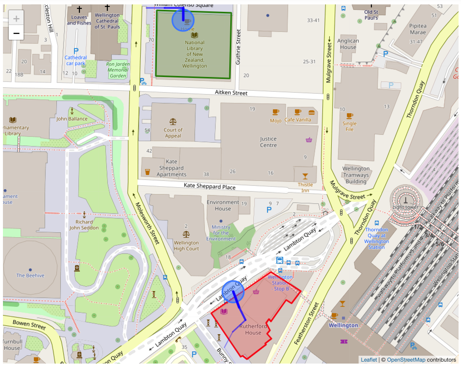

# tile38-viewer
A tool to visualise the state of events in Tile38

Zero configuration* - queries all geofence [channels](https://tile38.com/commands/setchan/) and [keys](https://tile38.com/commands/keys/) in your [Tile38](https://github.com/tidwall/tile38) instance.

Shows current state of items within tile38:


Highlights simple enter/exit/cross geofence events:


*May require some configuration.

# Quickstart - on server
```
wget https://raw.githubusercontent.com/leighghunt/tile38-viewer/master/docker-compose.yml
wget https://raw.githubusercontent.com/leighghunt/tile38-viewer/master/docker-environment-list
sudo docker-compose up -d
```
* Ensure that ports 80, 443 and 9851 are open to traffic.

## On local machine using [tile38-cli](https://tile38.com/topics/command-line-interface/):
```
$ tile38-cli -h <host>
<host>:9851> chans *
{"ok":true,"chans":[],"elapsed":"4.63µs"}
<host>:9851>
```


## Updating geofences in Tile38
```
SETCHAN buildingTiakiwai WITHIN traffic FENCE DETECT enter,exit,cross OBJECT {"type":"Polygon","coordinates":[[[174.77801,-41.27632],[174.77800,-41.27686],[174.77881,-41.27688],[174.77883,-41.27634],[174.77801,-41.27632]]]}

SETCHAN buildingRutherfordHouse WITHIN traffic FENCE DETECT enter,exit,cross OBJECT {"type":"Polygon","coordinates":[[[174.77861,-41.27881],[174.77893,-41.27917],[174.77895,-41.27916],[174.77900,-41.27919],[174.77921,-41.27907],[174.77920,-41.27906],[174.77927,-41.27902],[174.77922,-41.27898],[174.77925,-41.27895],[174.77921,-41.27889],[174.77924,-41.27886],[174.77926,-41.27888],[174.77943,-41.27870],[174.77949,-41.27873],[174.77959,-41.27863],[174.77926,-41.27847],[174.77861,-41.27881]]]}
```


## Updating points in Tile38
```
SET traffic Alice POINT -41.2763 174.7779
SET traffic Alice POINT -41.2763 174.7781
SET traffic Alice POINT -41.2763 174.7783
SET traffic Alice POINT -41.2764 174.7783

SET traffic Bob POINT -41.279823 174.779713
SET traffic Bob POINT -41.279575 174.779228
SET traffic Bob POINT -41.279269 174.778916
SET traffic Bob POINT -41.279091 174.778754
SET traffic Bob POINT -41.278963 174.778845
SET traffic Bob POINT -41.278867 174.778982
SET traffic Bob POINT -41.278763 174.778914
SET traffic Bob POINT -41.278634 174.778848
```




# Walkthrough start on Ubuntu Server 18.04 LTS (HVM)
https://docs.docker.com/install/linux/docker-ce/ubuntu/
```
$ sudo apt-get update

$ sudo apt-get install \
    apt-transport-https \
    ca-certificates \
    curl \
    gnupg-agent \
    software-properties-common

$ curl -fsSL https://download.docker.com/linux/ubuntu/gpg | sudo apt-key add -

$ sudo apt-key fingerprint 0EBFCD88

pub   rsa4096 2017-02-22 [SCEA]
  9DC8 5822 9FC7 DD38 854A  E2D8 8D81 803C 0EBF CD88
uid           [ unknown] Docker Release (CE deb) <docker@docker.com>
sub   rsa4096 2017-02-22 [S]

$ sudo add-apt-repository \
   "deb [arch=amd64] https://download.docker.com/linux/ubuntu \
   $(lsb_release -cs) \
   stable"

$ sudo apt-get update

$ sudo apt-get install docker-ce docker-ce-cli containerd.io

$ sudo docker run hello-world

$ sudo curl -L "https://github.com/docker/compose/releases/download/1.24.1/docker-compose-$(uname -s)-$(uname -m)" -o /usr/local/bin/docker-compose

$ sudo chmod +x /usr/local/bin/docker-compose

$ docker-compose --version
docker-compose version 1.24.1, build 4667896b

$ wget https://raw.githubusercontent.com/leighghunt/tile38-viewer/master/docker-compose.yml
$ wget https://raw.githubusercontent.com/leighghunt/tile38-viewer/master/docker-environment-list
$ sudo docker-compose up -d
```
