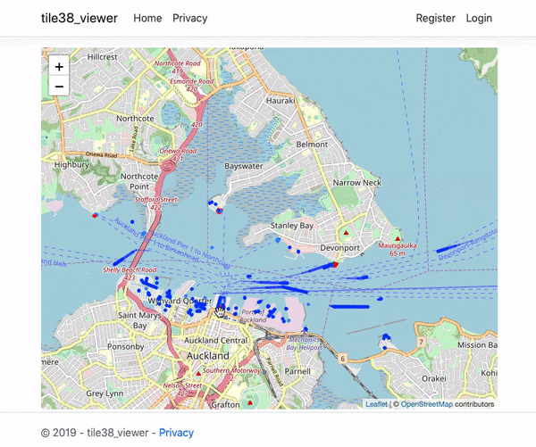
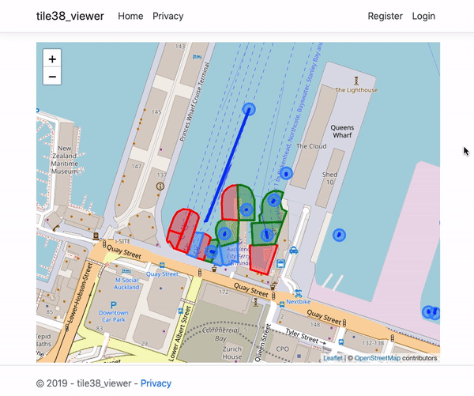

# tile38-viewer
A tool to visualise the state of events in Tile38

Zero configuration* - queries all geofence [channels](https://tile38.com/commands/setchan/) and [keys](https://tile38.com/commands/keys/) in your [Tile38](https://github.com/tidwall/tile38) instance.

Shows current state of items within tile38:

Highlights simple enter/exit/cross geofence events:

*May require some configuration.
